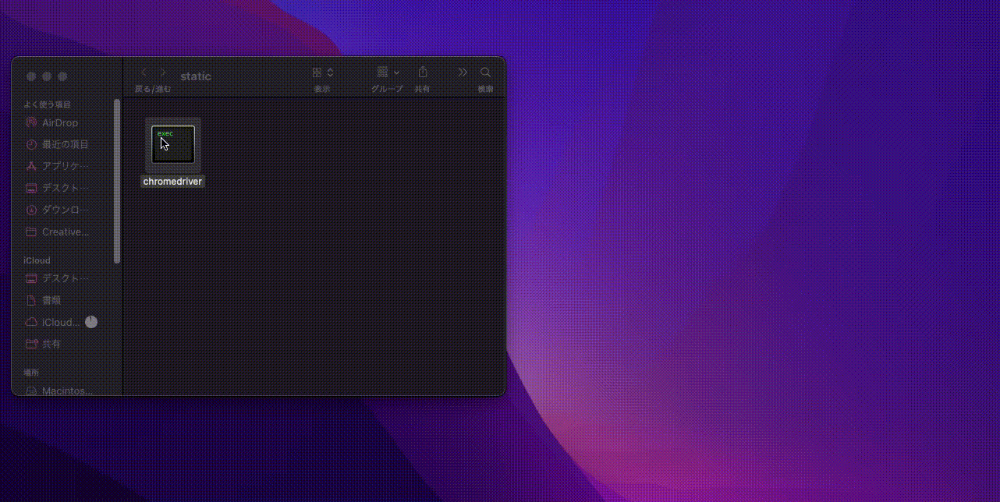

## 環境構築

環境構築については、緊急性が低いため省略させていただきます。
タイミングで作成します。

## chromedriver について

このスクレイピングツールは、一部 chromedriver を使用しているため、GoogleChrome を最新バージョンを使用してください。

バージョンアップで使用でき亡くなるケースもあるので、その場合は、開発者にご連絡ください。

## chromedriver の起動方法(Mac)

インストール初期 または アップデートにより最初に使用する際には以下のフローを行っていただく必要があります。

1. リポジトリ直下の /static ディレクトリを開く
2. chromedriver を 右クリックで「開く」を選択
3. 確認モーダルも「開く」を選択
4. ターミナルが起動するので、文末の「successfully」を確認する
5. それぞれの画面を閉じる

